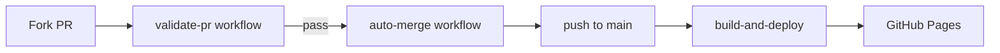

# Build My Site

A public, community-editable website where anyone can submit a pull request to add their own page. PRs are automatically validated, approved, and merged — no human review required.

Built for a TikTok/YouTube experiment: strangers on the internet collaboratively build a webpage.

## How it works



1. Contributor adds `contributions/<name>/page.html` + `meta.json` via PR.
2. **validate-pr** (on `pull_request`, read-only) checks the diff for safety rules.
3. **auto-merge** (on `pull_request_target`, no PR code executed) approves and squash-merges.
4. **build-and-deploy** (on push to `main`) geocodes locations, builds JSON artifacts, and deploys to GitHub Pages.

## One-time setup checklist

After pushing this repo to GitHub ([pushthis/buildmysite](https://github.com/pushthis/buildmysite)):

### 1. Enable GitHub Pages

1. Open **https://github.com/pushthis/buildmysite/settings/pages**
2. Under **Build and deployment**, set **Source** to **GitHub Actions**
3. Save — you won't see a live URL until the first deploy workflow completes on `main`

### 2. Workflow permissions

1. Open **https://github.com/pushthis/buildmysite/settings/actions**
2. Scroll to **Workflow permissions**
3. Select **Read and write permissions**
4. Check **Allow GitHub Actions to create and approve pull requests** (needed for auto-merge)
5. Click **Save**

### 3. Branch protection on `main` (required for safe auto-merge)

This ensures a PR cannot merge unless validation passes first.

**Preferred: use a ruleset with “Require workflows to pass”** (works even when the status-check dropdown is empty):

1. Open **https://github.com/pushthis/buildmysite/settings/rules**
2. Click **New ruleset** → **New branch ruleset**
3. Name it e.g. `protect-main`
4. **Enforcement status:** Active
5. **Target branches:** click **Add target** → **Include by pattern** → enter `main`
6. Under **Rules**, enable:
   - **Require a pull request before merging** — set **Required approvals** to `0`
   - **Require workflows to pass before merging** — click **Add workflow**, pick **Validate PR** (`.github/workflows/validate-pr.yml`)
7. Save changes

Why the status-check dropdown is empty: GitHub only lists named checks (like `validate-pr`) *after* that workflow has run on a pull request at least once. “Require workflows to pass” selects the workflow file itself, so you don’t need a prior run.

**If you prefer classic branch protection / “Require status checks” instead:**

1. First seed the check by opening any PR against `main` (even a tiny docs change). Wait until you see the **validate-pr** check appear on the PR page (it may fail — that’s fine for seeding).
2. Then go to **Settings → Branches → Add classic branch protection rule**, pattern `main`, enable **Require status checks to pass**, and select **`validate-pr`**.

**How to confirm it's working:** Open a contribution PR. You should see **Validate PR** / **validate-pr** run. The PR should stay blocked until it is green.

### 4. Enable auto-merge

Auto-merge lets the bot squash-merge a PR as soon as it's approved and all checks pass.

1. Open **https://github.com/pushthis/buildmysite/settings**
2. Scroll to the **Pull Requests** section (near the bottom of the General settings page)
3. Check **Allow auto-merge**
4. Click **Save** if prompted

**How to confirm it's working:** On a test PR that passes validation, you should see the **auto-merge** workflow run (approve + squash merge) without you clicking Merge manually.

### 5. Visitor counter (GoatCounter) — already wired

GoatCounter (`terpinedream.goatcounter.com`) is already embedded in `index.html`, `explore.html`, and `view.html`. The marquee fetches totals from GoatCounter’s public count API.

After the site is live, visit a few times and check https://terpinedream.goatcounter.com/ — counts should appear within a minute or two. Ad blockers can hide client tracking; the dashboard is the source of truth.

### 6. Optional: Nominatim User-Agent (local builds only)

The build workflow sets this automatically in CI. For local builds:

```bash
export NOMINATIM_USER_AGENT="buildmysite/1.0 (https://github.com/pushthis/buildmysite)"
```

## Local development

```bash
npm run build    # generates dist/index.json, dist/pins.json, copies page.html files
```

Serve locally (requires a static server):

```bash
npx serve .
```

Open `http://localhost:3000` — the site loads data from `/dist/`.

## Security model

### Why two workflows?

**`pull_request_target` runs with write access to the base repo.** If that workflow checked out and executed code from a PR (e.g. `npm install`, running a PR-supplied script), an attacker could exfiltrate secrets.

Our split:

| Workflow | Event | Runs PR code? | Permissions |
|----------|-------|---------------|-------------|
| validate-pr | `pull_request` | Yes (read-only inspection) | contents: read |
| auto-merge | `pull_request_target` | **No checkout at all** | contents + PRs: write |
| build-and-deploy | `push` to main | Only trusted merged code | pages + contents: write |

### Validation guardrails

The validator ([scripts/validate-pr.mjs](scripts/validate-pr.mjs)) rejects PRs that:

- Touch files outside `contributions/<name>/`
- Change more than one contributor folder
- Include files other than `page.html` and `meta.json`
- Exceed 20 KB per folder
- Contain scripts, iframes, inline handlers, external URLs, etc.
- Have invalid `meta.json` schema
- Match words in [scripts/banned-words.json](scripts/banned-words.json) (extend this list anytime)

### Sandboxed rendering

All contributions render inside `<iframe sandbox="">` with no `allow-scripts` and no `allow-same-origin`. Even if something slips past validation, it cannot run JavaScript or access cookies.

### Rate limiting

Validation checks whether the PR author merged another PR in the last 60 seconds. IP-based limiting is not feasible in GitHub Actions — see CONTRIBUTING.md note about bot floods.

## Geocoding

Locations in `meta.json` are geocoded via [OpenStreetMap Nominatim](https://nominatim.org/) during the build step.

- **Rate limit:** 1 request per second (enforced in [scripts/geocode.mjs](scripts/geocode.mjs))
- **Cache:** Results stored in [data/geocode-cache.json](data/geocode-cache.json) and committed back to `main` by CI
- **Policy:** Always send a valid `User-Agent` identifying your project

Failed geocodes skip the map pin but the contribution still appears in Explore.

## Emergency rollback

If something bad gets merged during a live stream:

```bash
# See recent commits
git log --oneline -5

# Option A: Revert a specific bad commit (safe)
./scripts/rollback.sh <bad-commit-sha>

# Option B: Hard reset to previous commit (destructive)
./scripts/rollback.sh --last-good
```

The site redeploys automatically after pushing to `main`.

### Snapshots branch

A scheduled workflow pushes the full repo to the `snapshots` branch every 15 minutes. Restore contributions from a snapshot:

```bash
git fetch origin snapshots
git checkout origin/snapshots -- contributions/
```

## Project structure

```
contributions/<slug>/   Source contributions (page.html + meta.json)
scripts/build.mjs       Build pipeline
scripts/validate-pr.mjs PR validation (extensible rules)
scripts/geocode.mjs     Nominatim client + cache
data/geocode-cache.json Committed geocode cache
dist/                   Generated at build time (gitignored locally)
assets/                 Site CSS and JS
.github/workflows/      CI/CD pipelines
```

## Extending moderation

Add words to [scripts/banned-words.json](scripts/banned-words.json) — validation checks both `page.html` and `meta.json`.

For new validation rules, add functions in [scripts/validate-pr.mjs](scripts/validate-pr.mjs) and call them from `main()`.

## License

Contributions are submitted via PR and displayed on the public site. Add a license file if you want to specify terms.
